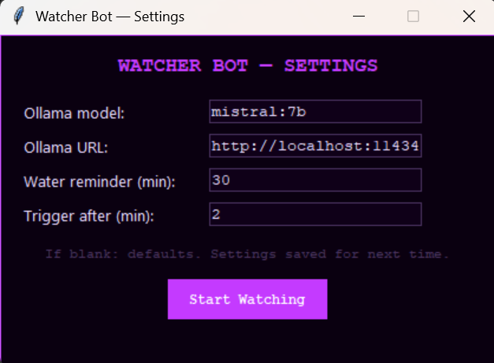

# WorkWatch
App that helps user focus on work, making staying on non-productive windows annoying. Also reminds to drink water.

A lightweight productivity monitor that nags you back to work 
when you've been procrastinating too long, and reminds you to 
drink water every 30 minutes.

## Features
- Detects non-productive windows and fires escalating popup warnings
- Water/stretch reminders on a configurable timer
- Learns which windows are work vs not-work over time
- Glitchy visual style with optional sound alerts
- No persistent background process — runs in system tray area

## Requirements
- Python 3.11+
- Ollama running locally (https://ollama.com)
- Windows (May update for Linux/Mac in future)

## Installation

1. Clone this repo
2. Install dependencies:
   pip install -r requirements.txt
3. Pull an Ollama model (mistral:7b recommended):
   ollama pull mistral:7b
4. Run:
   py -3.11 workwatch.py

## Configuration
On first run, a settings dialog lets you set:
- Ollama model name
- Ollama server URL
- Water reminder interval (minutes)
- Time on non-productive window before triggering (minutes)

Settings are saved to `watcher_settings.json` for future runs.

## How window classification works
Windows are classified as productive or not in three tiers:
1. **Always non-productive** — YouTube, Netflix, WhatsApp etc (hardcoded)
2. **Always productive** — VS Code, PowerPoint, terminal etc (hardcoded)  
3. **User-classified** — when an unknown window appears, a popup asks 
   you to classify it. Answer is saved permanently to `known_windows.json`.
   No answer in 30 seconds = treated as productive.

You can also edit `known_windows.json` directly.

## Screenshot

## License
MIT
